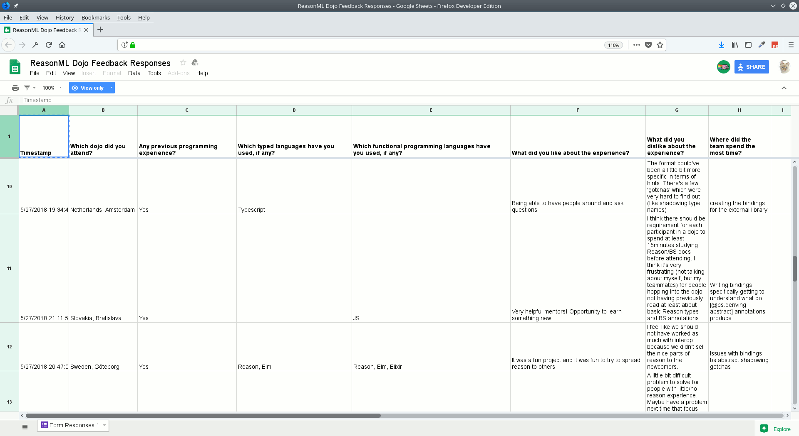

# Converting CSV to HTML

Recently, [@bsansouci](https://github.com/bsansouci) organized a ReasonML dojo that was held simultaneously in several locations in Europe. He provided a feedback form for attendees, and put the results in a Google document, which looks like this:



The problem is that you have to scroll horizontally to read the spreadsheet, and it’s not pleasant to read in any event. I decided to [export the spreadsheet as CSV](./feedback.csv), then write a program in ReasonML to convert the CSV to a [somewhat more readable HTML form](./europe_dojo_feedback.html). I learned a lot of things writing this, and I’ll share them with you here.

## The Big Picture

Here’s my plan for the program, which I run from the command line as follows:

```
node src/DojoComments.bs.js inputfile.csv outputfile.html
```

* Get the input and output file names from the command line
* Read the input CSV file as one large string
* Parse the CSV
* Separate the first (header) row from the remaining rows
* For each row, create a string that has a definition list `<dl>` with the heading for each column as the `<dt>` and the contents of the cell as the `<dt>`.
* Join these strings with `<hr />` elements (to make them easier to read when displayed).
* Sandwich the resulting string between an `<html>...` and `</html>`
* Write to the output file

## Reading Command Line Arguments

Looking at the documentation for [`Node.process.argv`](https://nodejs.org/docs/latest/api/process.html#process_process_argv) lets me read an array of  command line arguments. The last element is the output file name, and the next to last is the input file name. Current best practice in ReasonML is to use the `Belt.Array` module to manipulate arrays. I suspected I would be doing a lot of calls to functions from that module, and I didn’t want to type `Belt.Array` all the time, so I used a module alias at the top of my code:

```reason;shared(Args)
module Arr = Belt.Array;
/* ... */
let args = Node.Process.argv;
let outFile = Arr.getUnsafe(args, Arr.length(args) - 1);
let inFile = Arr.getUnsafe(args, Arr.length(args) - 2);
```

This is where (not for the first time during this program) I got lazy. `Belt.Array.get()` returns `option` type, and I really didn’t want to deal with that, so I went with `getUnsafe()`, which means that if you don’t provide enough arguments to the program, it will crash.

## Reading the Input File

ReasonML has an interface to Node’s file system, written in BuckleScript. From [the documentation](https://bucklescript.github.io/bucklescript/api/Node.Fs.html) I was able to find the `readFileAsUtf8Sync()` function, which reads the entire file in as a single string. This would not be a good thing to use if I had an enormous, multi-gigabyte CSV file, but for a file the size that I was dealing with, it will do. It’s a synchronous call, so I don’t have to deal with callbacks. When the program finishes, I’ll use the corresponding `writeFileAsUtf8Sync()` to do my output.

```reason;use(Args);shared(allLines);
let allLines = Node.Fs.readFileAsUtf8Sync(inFile);
```

## Parsing the CSV


